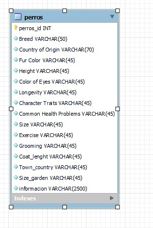

# Proyecto ETL ( Extract, Transform, and Load)    

## Este proyecto consta de 3 pasos.
    
    - Extraer datos desde 3 fuentes distintas y con 2 métodos de extracción.
        + Fuentes: Kaggle y dos webs,
        + Métodos: csv y web scraping con selenium.
    
    - Transformar datos. Limpieza con pandas.

    - Extraccion y carga de datos en SQL
    

## Paso 1: Extracción de datos.

Descarga de archivo csv en Kaggle sobre las razas de perro.
Web scraping en web 1: 
    He sacado información adicional sobre todas las razas.
    He añadido esta información al csv original.

Web scraping en web 2:
    Breve descripcion de algunas razas.
    Antes de añadir la informacion al csv original, he traducido todo el DataFrame a ingles.
    

## Paso 2: Transformación datos

Limpieza de los DataFrames intermedios creados para finalmente unirlo al original.
Limpieza del DataFrame final

# Paso 3: Cargar datos en SQL.

---

He creado una unica tabla en SQL para almacenar toda la información.

